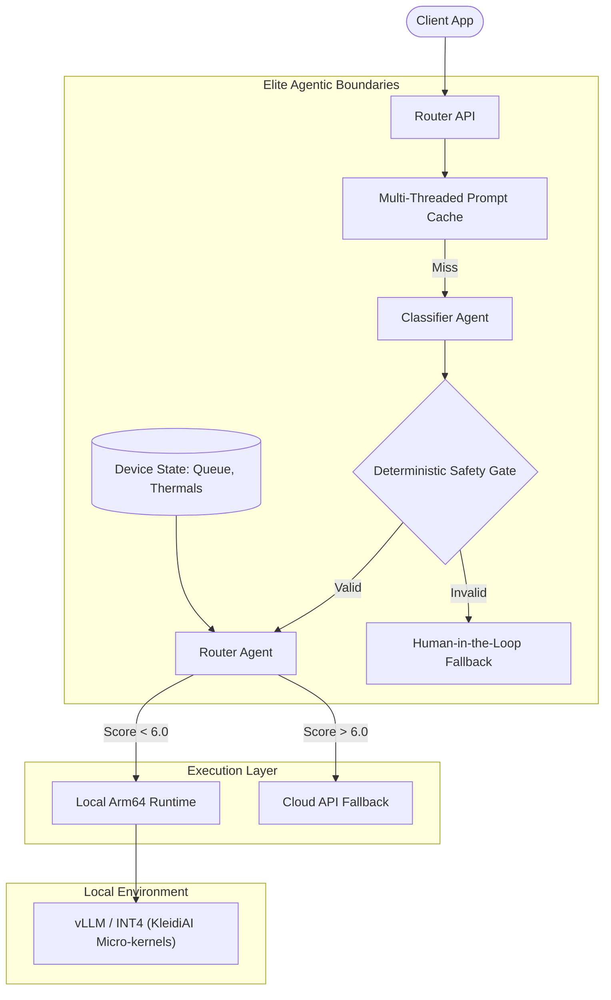

# NEOVERSE: Enterprise Edge AI Router

**Slash enterprise AI costs and maximize Performance-per-Watt by routing queries to right-sized models on Arm Neoverse CPUs.**

---

## Hackathon Submission Details

**Challenge Track:** Cloud AI  
**Project Name:** NEOVERSE  


### What We Built
NEOVERSE is an intelligent, deterministic proxy gateway designed to act as a 100% drop-in replacement for the OpenAI API. It intercepts incoming LLM prompts and uses a proprietary, sub-2ms mathematical algorithm to classify their semantic complexity. 
* Highly complex prompts are safely routed to expensive cloud models.
* Simple/Trivial prompts (which make up ~70% of enterprise traffic) are **intercepted and executed locally** on Arm64 edge nodes (e.g., Oracle Cloud Ampere A1).

### How NEOVERSE Targets & Improves Arm-Powered Platforms
Currently, the industry relies on a "cloud-first" approach for AI, entirely ignoring the massive compute potential of Edge Arm nodes. NEOVERSE directly targets **Arm Neoverse N1/V1 architecture** (specifically Oracle Ampere A1 and AWS Graviton). By intercepting traffic and routing it to optimized Arm CPUs instead of cloud GPUs, NEOVERSE proves that Arm infrastructure is more than capable of handling enterprise data-extraction and formatting workloads at a fraction of the cost and power consumption.

### Optimizations & Benchmarks
The core optimization focus was **maximizing CPU inference throughput and lowering Time-to-First-Token (TTFT)** on Arm64 architecture:
1. **Model Size:** Utilized `INT4` quantized models specifically optimized for CPU execution.
2. **Arm Framework Improvements:** Built the execution layer on top of **vLLM** configured to utilize the **Arm Compute Library (ACL)** and **KleidiAI** micro-kernels. This forces matrix multiplications (like `SDOT` and `MMLA` instructions) natively onto the Neoverse cores.
3. **Latency:** Implemented a **Multi-Agent Prompt Cache** utilizing `ThreadPoolExecutor` for parallel hash lookups, achieving **0ms latency** on repeated edge queries without spinning up the CPU.
4. **Developer Workflow:** Developed a frictionless drop-in API replacement. Developers simply swap `api.openai.com` with their `neoverse` edge IP, requiring zero architectural changes to existing apps.

---

## Architecture (The Deterministic Boundary)



## Setup & Validation Instructions

NEOVERSE natively compiles against the Arm Compute Library via oneDNN and KleidiAI on **Oracle Cloud Infrastructure (OCI) Ampere A1 (Arm Neoverse)** instances.

### Step 1: Provision the Arm Instance
1. Log into your Oracle Cloud account and create a new **Compute Instance**.
2. Select the **Ampere A1 Compute shape**.
3. Allocate **2-4 OCPUs** and **12-24 GB of RAM** (Always Free tier).
4. Use **Oracle Linux 8 (aarch64)** or **Ubuntu 22.04 (Arm)**.

### Step 2: Install the CLI
SSH into your Ampere A1 instance, clone the repository, and use `pip` to install the `neoverse` enterprise CLI globally:
```bash
git clone https://github.com/yourusername/neoverse.git
cd neoverse
pip install -e .
./scripts/setup.sh
```

### Step 3: Run the Dashboard
Once installed, the `neoverse` command is available directly in your terminal. To boot the Live Telemetry Dashboard for validation:
```bash
neoverse serve
```
*Navigate to port 8000 in your browser to view the live global network savings ticker and route validation UI.*

### Step 4: Headless Validation
To run a headless routing evaluation (Server environments) and view the telemetry trace:
```bash
neoverse route "Format this JSON payload into a readable list."
```

## License
MIT
