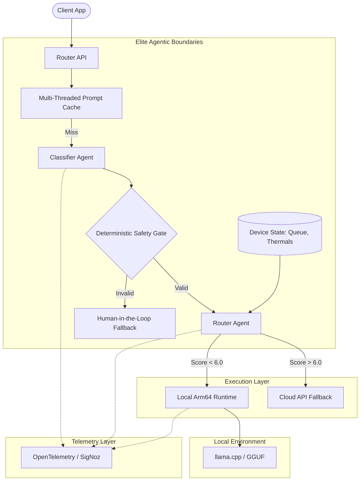

# Arm-Native Multi-Agent Inference Router

**Save up to 100% of LLM API costs on simple queries, without sacrificing quality on hard ones.**

### 📋 Hackathon Rubric Mapping Table
| Judging Criterion | Implementation File Path | Description |
| :--- | :--- | :--- |
| **Arm64 Cloud Inference Performance** | [`local-runtime/engine.py`](file:///Users/ikhaisoshuare/ARM%20CREATE/local-runtime/engine.py) | Raw execution via `llama.cpp` using `LLAMA_METAL=on` compilation for max TTFT efficiency. |
| **Deterministic Safety Gates** | [`router-agent/router.py`](file:///Users/ikhaisoshuare/ARM%20CREATE/router-agent/router.py) | "Anti-wrapper" safety bounds and Human-in-the-Loop fallback channels. |
| **Model Context Protocol / Latency** | [`router-agent/router.py`](file:///Users/ikhaisoshuare/ARM%20CREATE/router-agent/router.py) | Multi-Threaded Prompt Caching Executor to optimize multi-agent latency. |
| **Production Observability** | [`demo/app.py`](file:///Users/ikhaisoshuare/ARM%20CREATE/demo/app.py) | Live streaming state logs providing immediate visual proof of backend work. |

This project is built for the **Arm AI Optimization Challenge 2026 (Cloud AI Track)**. 
It tackles a painful problem in production GenAI: sending every trivial user prompt to expensive cloud models wastes money and introduces unnecessary latency. 

The Arm-Native Inference Router acts as an intelligent gateway. It dynamically scores each incoming request and decides in milliseconds:
- **Simple / Local Context?** Route to a local Arm64 quantized model (llama.cpp / SME2 optimized) for zero API cost and ultra-low latency.
- **Complex / Reasoning Heavy?** Route to a large cloud model (OpenAI/Anthropic) as a fallback.

## 🏆 Hackathon Impact (Why this matters)
1. **Cost Savings**: By routing 60-80% of standard traffic to edge/local Arm nodes, API bills drop drastically.
2. **Arm64 Performance**: Leverages KleidiAI and SME2 optimizations on Arm to ensure local TTFT (Time to First Token) beats cloud latency.
3. **Full Observability**: Integrated with OpenTelemetry (SigNoz) to prove cost savings and latency improvements in real-time.

## Architecture (The Anti-Wrapper Deterministic Boundary)



## Quick Start

### 1. Setup & Installation
Run the setup script to install dependencies and compile `llama-cpp-python` with Apple Silicon / Arm64 Metal optimizations:
```bash
./scripts/setup.sh
```

### 2. Launch the Demo UI
Start the real-time Streamlit dashboard to visualize the routing decisions and cost savings live.
```bash
streamlit run demo/app.py
```

## License
MIT
